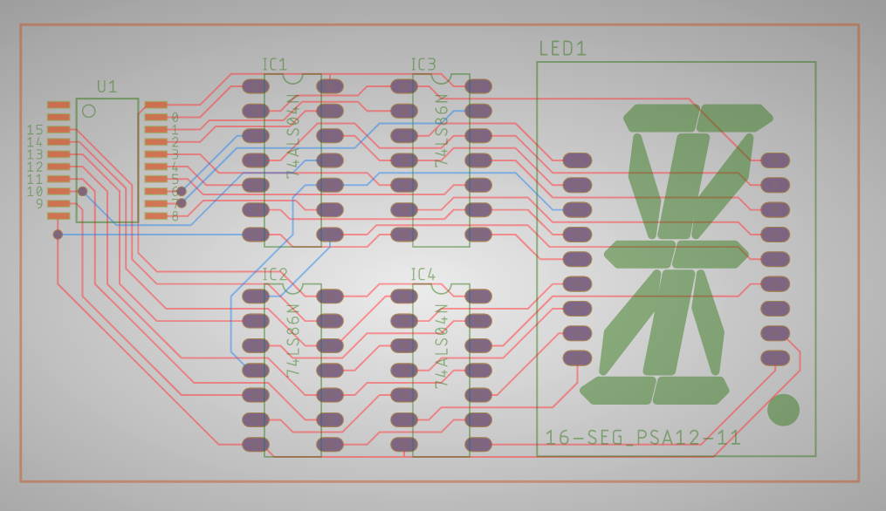

# Challenge 5

### Description:
We found another one of those displays laying around, but it seems this one is a bit more complex. Not only is it a 16-segment display, it seems to have some extra ICs on the board to modify the signals coming out of the controller. Whatever it was displaying was flashing far too fast for us to read, so we quickly did a signal capture (aligning capture channel with the numbers marked on the PCB’s silkscreen) and got out of there.

It seems whoever had made that device had fabricated the PCB on a public site and we were able to retrieve the Gerber files! Can you help us reverse engineer the circuit and recover what was being set on the 16-segment display?

### Objective:
* Learn about gerber files
* View the gerber files to learn about the PCB
* Research parts/find datasheets

### Difficulty:
* `medium`

### Flag:
* `flag{50_mUch_r0oM_4_AlphaANum_aCTiv1tIe$}` 

### Challenge:

The player is provided a Logic 1 capture with sixteen channels and gerber files for a PCB. The majority of this challenges requires investigating what the PCB is doing and researching the two types of ICs on the PCB (a quad XOR and a hex inverter) as well as the 16-segment display. The player can then emulate the logic operations of the PCB either manually or with a script. The parallel binary data can then be routed through the logic operations to get the 16-segment output. The output of the logic operations can then be mapped to the 16-segment display by looking up the part number captured in the PCB files. When the player simulates the display, they'll see "I Hope No One Can See This flag{50_mUch_r0oM_4_AlphaANum_aCTiv1tIe$}".

_Note: there was a mistake with this challenge, and while the 16-segment display used is common-anode, the data treats it as if it were common-cathode._

### Solver:

chal5._solver.py is a Python3 script or assisting in solving this challenge by simulating the logic opperations that the PCB would perform. This script digitally emulates the logic opperations that would be performed by the SN74LS86 and SN74ALS04 ICs. The user is able to type in the binary number conveyed by the columns of parallel data (ch0 is MSBit, ch15 is LSBit) and the script applies the same logic opperations that the PCB would, then corrects the bit order out to be alphabetical (ABC...U) for matching with the alphabetically named segments of the 16-segment display.